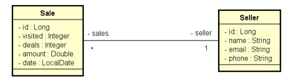

# Desafio – Consulta de Vendas 

API REST desenvolvida em **Java com Spring Boot** para consulta e consolidação de dados de vendas, utilizando **Spring Data JPA**, **H2 Database** e **queries nativas SQL**.

O projeto disponibiliza endpoints para:
- Relatório detalhado de vendas com filtros
- Resumo de vendas agrupado por vendedor

---

##  Modelo de Domínio

O sistema é composto pelas seguintes entidades:
## Modelo de Domínio



### Seller
- `id`
- `name`
- `email`
- `phone`

### Sale
- `id`
- `date`
- `amount`
- `visited`
- `deals`
- `seller`

---

##  Estrutura do Projeto

```text
src/main/java/com/devsuperior/dsmeta
 ├── controllers
 │    └── SaleController.java
 ├── dto
 │    ├── SaleReportDTO.java
 │    └── SaleSummaryDTO.java
 ├── entities
 │    ├── Sale.java
 │    └── Seller.java
 ├── repositories
 │    └── SaleRepository.java
 ├── services
 │    └── SaleService.java
 └── DsmetaApplication.java
```
## Endpoints / Exemplos de requisições

### Buscar venda por id
```http
GET /sales/{id}
```

###Relatório de vendas
```http
GET /sales/report
```
### Resumo de vendas por vendedor
```http
GET /sales/summary?minDate=2022-01-01&maxDate=2022-06-30
```
### Relatório de vendas com filtros
```http
GET /sales/report?minDate=2022-05-01&maxDate=2022-05-31&name=odinson
```

Parâmetros opcionais:
- minDate (yyyy-MM-dd)
- maxDate (yyyy-MM-dd)
- name
- page
- size

###Resumo de vendas por vendedor
```http
GET /sales/summary
```
## Tecnologias utilizadas

- Java
- Spring Boot
- Spring Data JPA
- H2 Database
- Maven


## Executando o projeto

O projeto pode ser executado diretamente pela IDE.

Passos:
1. Clonar o repositório.
2. Importar o projeto como **Maven Project** na IDE.
3. Executar a classe principal `DsmetaApplication`.

Após iniciar a aplicação, a API ficará disponível em:
http://localhost:8080

## Autor
Willian Ataides

